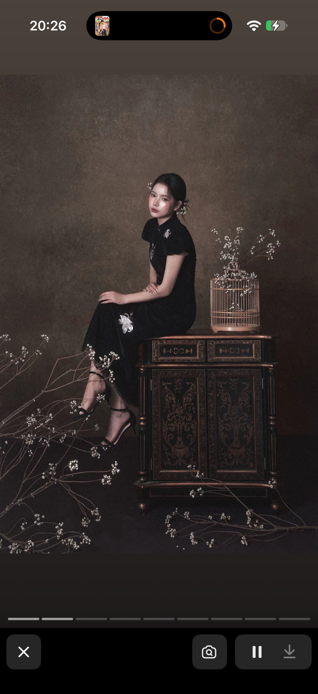

# 视听语言学习笔记

## 模块A1：景别（9/25 学习）
> 视频：B站 BV1Qk5M62E6T P1景别 / P2景别意义 / P3景别组接

### 五档景别（边看边填）
| 景别 | 画面范围 | 叙事功能/情绪 |
|---|---|---|
| 远景 | 人物大约占整个画面的四分之一大小 | 能交代人物环境 帮助观众建立第一印象和主角的故事背景 |
| 全景 | 人物全身显露 | 能了解人物具体在做什么 进一步表现人物肢体的动作 和环境的交互 更能体现人物和环境的关系 角色与角色的关系 |
| 中景 | 能拍到人物大部分身体 | 可以看清人物具体的动作和细节 还有其他人物的动作  |
| 近景 | 在人物腰部以上的画面 | 聚焦到人物的神情更能给观众传递角色的处境和感受 |
| 特写 | 是人物的某一个动作的一个肢体部分后者是人物的头肩之内的画面 | 指出重要物品和人物的某一处细节 |

### 易混点（看完写下）
- 特写 vs 近景，怎么一眼区分：近景在肩膀附近 但特写是演员身体的某一部分的动作和状态
- 景别组接（不同景别剪在一起）有什么讲究：
前进式拉近 从远——全——中——近——特 一步一步拉近 让观众沉浸进入到画面 过渡自然
后退式远离 从特——近——中——全——远 让观众脱离整个画面 一般用于葬礼或者结尾
循环式 远——全——中——近——特——近——中——全——远 有一些画面需要突出人物密集的动作包括想武打片的视角推拉
远——特 这种大切换 给人一种视觉冲击 是一些剑拔弩张的氛围下的切换
### 对我工作的用处
- 入职标"景别"标签时：清晰划分景别和含义 能分清前后剧情的节奏 更精确的标注让ai去细化s

## 模块A2：机位角度（10/3 学习）
> 视频：B站 BV1v4411x7Aj《视角与视点》

| 照片 | 机位（仰/俯/平） | 感觉/效果 |
|---|---|---|
|  | 平视 | 亲切、平静、真实 |
| （待补：一张明显仰拍） | | |
| （待补：一张明显俯拍） | | |

- 一句话规律：仰拍显权力/崇高/高大，俯拍显渺小/脆弱，平视显亲切/客观/真实。

